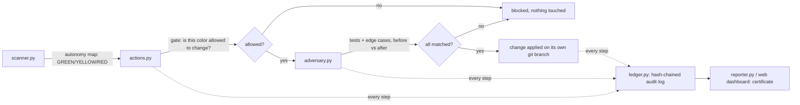
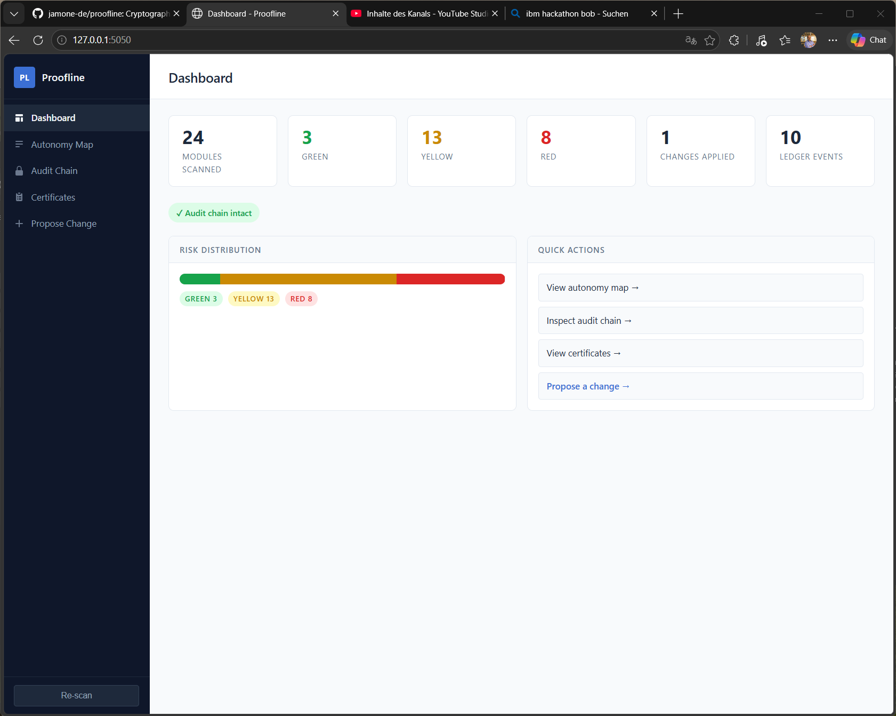
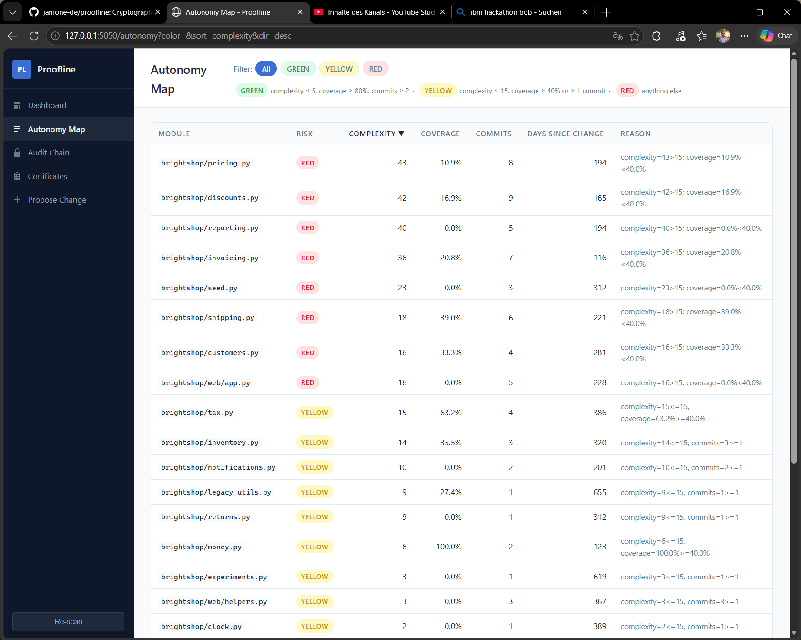
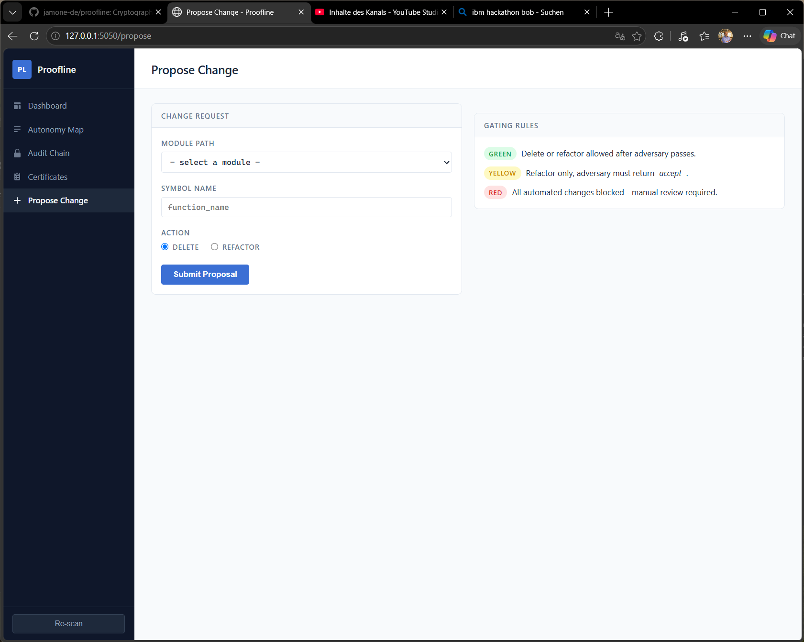
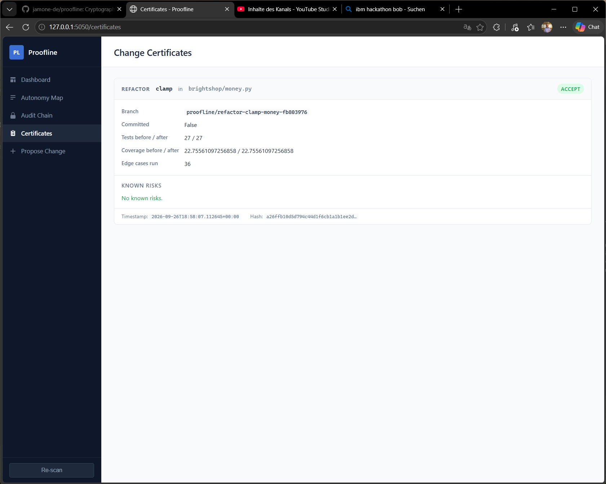
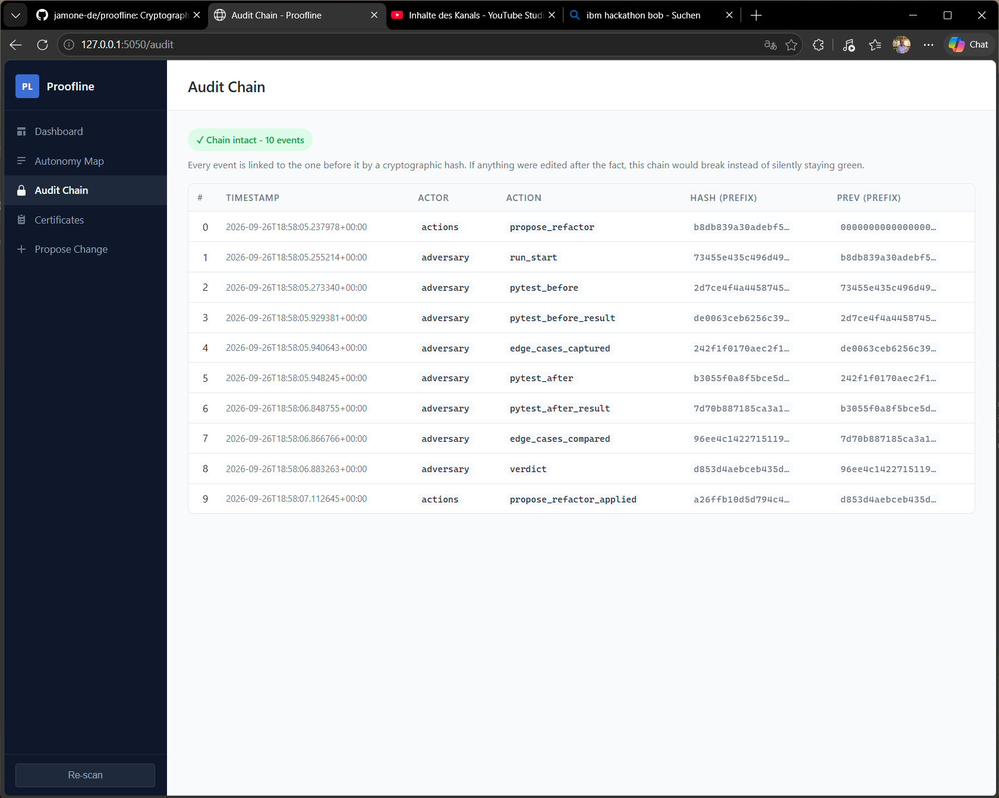

# Proofline

[](https://github.com/jamone-de/proofline/actions/workflows/tests.yml)
[](LICENSE)
[](https://www.python.org/)
[](https://lablab.ai/ai-hackathons/ibm-bob-2-hackathon)

A verification layer for autonomous coding agents. AI agents like IBM Bob can change
code faster than a human can review it. Proofline makes an agent prove a change is
safe before it gets applied, with a cryptographic record of every step.

## Why

An AI agent can propose a change in seconds. Reviewing it carefully still takes a
human minutes or hours. That gap is where trust breaks down: either someone rubber
stamps changes they didn't really check, or the agent's speed goes to waste while
a human reviews everything by hand.

Proofline closes that gap for a defined, low risk slice of changes. It never asks you
to trust an agent's word. It asks the agent to earn trust automatically, one verified
change at a time, and it refuses outright wherever it cannot.

## How it works



- **scanner.py** rates every module GREEN, YELLOW, or RED from AST complexity,
  test coverage, and git commit history, and prints the exact rule it used.
- **actions.py** gates what an agent may do: GREEN allows delete or refactor,
  YELLOW allows refactor only after verification passes, RED blocks everything
  automated and demands a human.
- **adversary.py** is the actual proof: it re-runs the real test suite and a set
  of generated edge cases before and after the change, and only accepts it if
  every result still matches.
- **ledger.py** records every step as a hash-chained, tamper-evident log. Edit
  one entry after the fact and the chain breaks instead of silently staying green.
- **reporter.py** and the **web dashboard** turn all of that into a certificate:
  every number on the page traces back to a real ledger entry or a real test run,
  nothing is precomputed or made up.

## Screenshots

| Dashboard | Autonomy Map |
|---|---|
|  |  |

| Propose Change | Certificates |
|---|---|
|  |  |

| Audit Chain |
|---|---|
|  |

## Videos

- [Proofline in action](https://youtu.be/MfRQSQgeC3A): the full pipeline running
  against Brightshop, a RED module correctly blocked, a YELLOW refactor verified
  and applied.
- [Bob at work](https://youtu.be/U-yBmOoUmdU): IBM Bob 2.0 building a piece of
  Proofline from a single prompt, live in the IDE.

## Quickstart

```bash
# Install dependencies (from project root)
pip install -r requirements.txt
pip install -r target_app/requirements.txt

# 1. Generate a real coverage baseline for the demo app
cd target_app
python -m pytest -q --cov=brightshop --cov-report=json:coverage.json
cd ..

# 2. Scan it and build the autonomy map
python main.py scan

# 3. Propose a change (CLI)
python main.py propose --delete   brightshop/pricing.py::calculate_order_total_v1
python main.py propose --refactor brightshop/money.py::clamp --new-code new_fn.py

# 4. Generate the HTML certificate
python main.py report        # writes docs/index.html

# 5. Or use the web dashboard instead of the CLI
python main.py serve --port 5050
# then open http://localhost:5050

# 6. Run the whole thing end to end, scripted
python run_demo.py

# 7. Run the test suite
python -m pytest proofline/tests -v
```

## What IBM Bob built, and what a human reviewed

Bob built the full `proofline/` package, the web dashboard, and every feature on
top of it, each from a single natural-language prompt. See
[`docs/bob-sessions/`](docs/bob-sessions/) for the session logs and screenshots
of each one.

None of that was merged blindly. Every session was reviewed by actually running
the code (not just reading it) before it was committed, and three real bugs plus
two smaller issues were found and fixed this way, one of them serious enough that
it would have silently disabled the tool's core verification step. The full,
honest account is in [`docs/verification-log.md`](docs/verification-log.md).

## Demo target: Brightshop

`target_app/` is Brightshop, a fictional shop back office built specifically to be
a realistic, deliberately messy legacy codebase: dead functions, hidden business
rules, uneven test coverage, and a synthetic two-year git history with uneven
churn per module. It is the input Proofline analyzes and changes, not part of
Proofline itself. See `target_app/README.md` for details.

`target_app/_ground_truth/` is the answer key used to build and check Brightshop.
It is git-ignored and was never read by Bob or by Proofline's own logic.

## Project layout

```
proofline/
├── ledger.py        Hash-chained JSONL flight recorder
├── scanner.py        AST complexity + git log + coverage -> autonomy map
├── adversary.py      pytest before/after + edge-case generation
├── actions.py        Gated propose_delete / propose_refactor
├── reporter.py        Generates docs/index.html certificate
├── web/              Flask dashboard (serves on :5050)
│   ├── app.py
│   ├── templates/
│   └── static/
└── tests/            Test suite (pytest)
main.py               CLI entry point
run_demo.py           Scripted end-to-end walkthrough
docs/
├── index.html         Generated certificate (see Quickstart)
├── verification-log.md   Honest record of what a human had to fix
├── bob-sessions/      Session logs and screenshots, one per Bob session
└── screenshots/       App screenshots used in this README
target_app/            Brightshop, the codebase being verified (see above)
```

## License

MIT, see [LICENSE](LICENSE).
